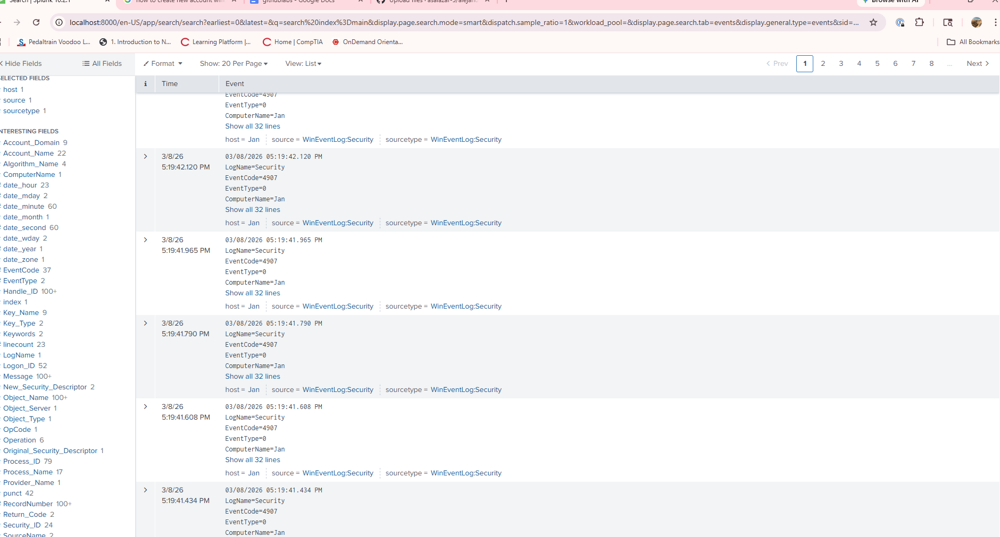

# Lab 01 – Log Analysis & Incident Detection (SOC Focus)

## Objective
The goal of this lab is to simulate a SOC-style investigation by analyzing authentication logs to identify suspicious activity such as repeated failed login attempts and potential brute-force attacks. This lab demonstrates practical experience in log analysis, incident detection, and security event triage.

---

## Tools Used
- Splunk Free
- Windows 10/11 Virtual Machine
- Windows Security Event Logs

---

## Lab Environment
- One Windows 10/11 VM acting as the log source
- Splunk installed locally or on a separate VM
- Windows Security logging enabled

---

## Step-by-Step Implementation

### Step 1: Install and Configure Splunk
1. Download and install Splunk Free.
2. Start Splunk and access the web interface.
3. Create an index for Windows security logs.

📸 **Screenshot:** Splunk dashboard showing successful setup.

---

### Step 2: Ingest Windows Security Logs
1. Open Event Viewer on the Windows VM.
2. Navigate to **Windows Logs → Security**.
3. Configure Splunk to ingest Security event logs.
4. Verify logs are searchable in Splunk.

📸 **Screenshot:** Splunk search showing Windows Security events.

---

### Step 3: Simulate Failed Login Attempts
1. Attempt to log in with incorrect credentials multiple times.
2. Trigger failed authentication events.
3. Note the timestamps and usernames used.

📸 **Screenshot:** Windows Event Viewer showing failed login events.

---

### Step 4: Analyze Logs in Splunk
1. Create searches for failed login events.
2. Identify:
   - Repeated failures from a single account
   - Multiple failures from the same source
3. Determine whether activity appears suspicious.

📸 **Screenshot:** Splunk query results highlighting failed login patterns.

---

### Step 5: Incident Triage & Documentation
1. Treat the activity as a potential brute-force attempt.
2. Determine severity and impact.
3. Decide when escalation would be required.
4. Document findings and recommended actions.

📸 **Screenshot:** Example incident notes or dashboard.

---

## Findings
- Multiple failed login attempts were identified within a short time window.
- Patterns were consistent with a brute-force attack scenario.
- Logs provided sufficient detail to support escalation decisions.

---

## Lessons Learned
- Authentication logs are critical for detecting account abuse.
- Pattern recognition is essential for SOC investigations.
- Proper logging enables effective incident response.

---

## Security+ Alignment
- Threat detection and monitoring
- Log analysis and security event correlation
- Incident response and escalation procedures

---

## Interview Talking Points
- “I analyzed Windows authentication logs in Splunk to detect repeated failed login attempts.”
- “I treated the activity as a potential brute-force attempt and determined escalation criteria.”
- “This lab mirrors SOC workflows such as monitoring, triage, and documentation.”

---

## Next Steps
- Expand this lab by adding alerting rules.
- Correlate authentication logs with network logs.
- Automate detection of repeated failed logins.

---

## Screenshots

### Splunk Dashboard

### Windows Security Logs Ingested

### Failed Login Attempts (Event ID 4625)

### Brute Force Detection Query

 

