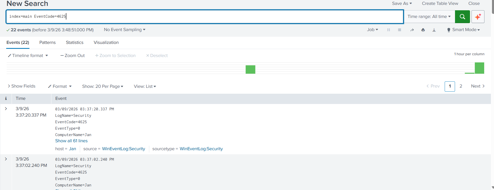

# Lab 03 – Brute Force Attack Detection (Splunk)

## Objective
The objective of this lab is to simulate a brute force login attack and detect it using Windows authentication logs ingested into Splunk.

This demonstrates how SOC analysts identify suspicious login activity and investigate potential credential attacks.

---

## Tools Used
- Kali Linux
- Windows 10/11 VM
- Splunk Enterprise
- Windows Security Event Logs

---

## Lab Environment

Attacker: Kali Linux VM  
Target: Windows host system  

Splunk collects Windows authentication logs from the target system.

---

## Attack Simulation

Multiple failed login attempts were generated against the Windows system to simulate a brute force attack.

These failed logins generate Windows Security Event ID:

4625 – Failed Logon

---

## Detection in Splunk

The following query was used to identify failed login attempts:

index=main EventCode=4625

This query returns Windows authentication failures that may indicate brute force attempts.

---

## Investigation

The logs were analyzed to identify:

• Source host  
• Target account  
• Frequency of failed logins  
• Potential brute force patterns  

SOC analysts typically escalate repeated failures from a single source.

---

## Skills Demonstrated

Security log analysis  
Authentication event monitoring  
Brute force attack detection  
SIEM investigation workflow  

---

## Screenshots

### Failed Login Attempts (Event Viewer)

### Splunk Search – Failed Login Detection

### Splunk Query – Brute Force Detection

### Splunk Results – Repeated Failed Logins

