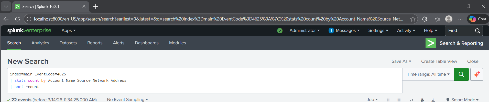
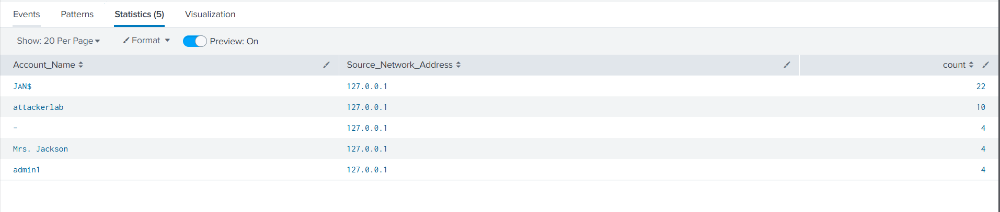

# Lab 05 – Threat Hunting Investigation (Splunk)

## Objective
The goal of this lab is to simulate a threat hunting investigation using Splunk by analyzing Windows event logs to identify suspicious activity.

Threat hunting allows security analysts to proactively search for malicious behavior that may not have triggered automated alerts.

---

## Tools Used
- Splunk Free
- Windows Security Event Logs
- Kali Linux (optional)
- VirtualBox Lab Environment

---

## Lab Environment

Log Source:
Windows Host Machine

Analysis Platform:
Splunk SIEM

Security logs were ingested into Splunk for analysis.

---

## Step 1 – Identify Suspicious Activity

Threat hunters often begin by reviewing authentication activity.

Example Splunk search:

index=main EventCode=4625

This query searches for **failed login attempts**.

---

## Step 2 – Identify Repeated Failed Logins

To detect potential brute-force behavior, the following query was used:

index=main EventCode=4625
| stats count by Account_Name, Source_Network_Address
| sort -count

This query identifies accounts with repeated authentication failures.

---

## Step 3 – Investigate Process Creation Activity

Threat hunters often investigate suspicious processes.

Example query:

index=main EventCode=4688

This identifies newly created processes.

Analysts can investigate suspicious processes such as:

- PowerShell
- Command Prompt
- Unknown executables

---

## Step 4 – Analyze Findings

The investigation revealed repeated authentication failures from a single source.

This behavior could indicate:

- Password spraying
- Brute force attack
- Misconfigured service account

Further investigation would determine whether the activity was malicious or benign.

---

## Security Analysis

Threat hunting is critical for detecting attacker behavior that may bypass automated detection systems.

Security analysts analyze patterns across logs to identify indicators of compromise.

---

## Skills Demonstrated

- Threat hunting methodology
- SIEM log analysis
- Authentication event investigation
- Security event correlation
- Incident investigation

---

## Screenshots

### Splunk Failed Login Investigation

## Screenshots

### Failed Login Investigation

### Threat Hunting Query

### Process Creation Investigation

### PowerShell Threat Hunt

### Splunk Threat Hunting Query

### Suspicious Login Analysis

